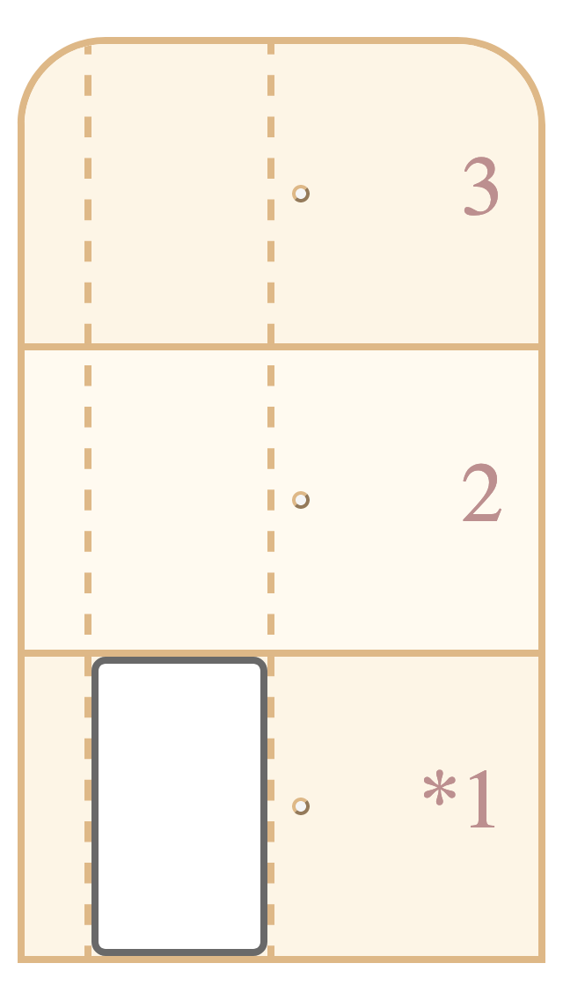
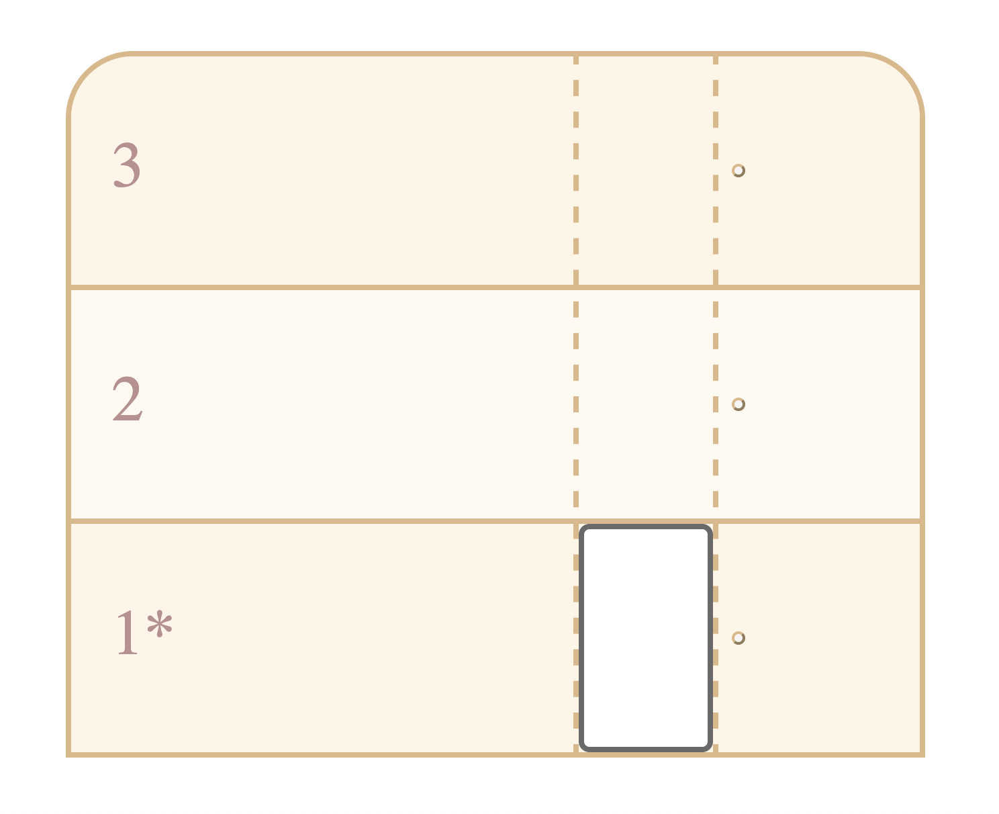
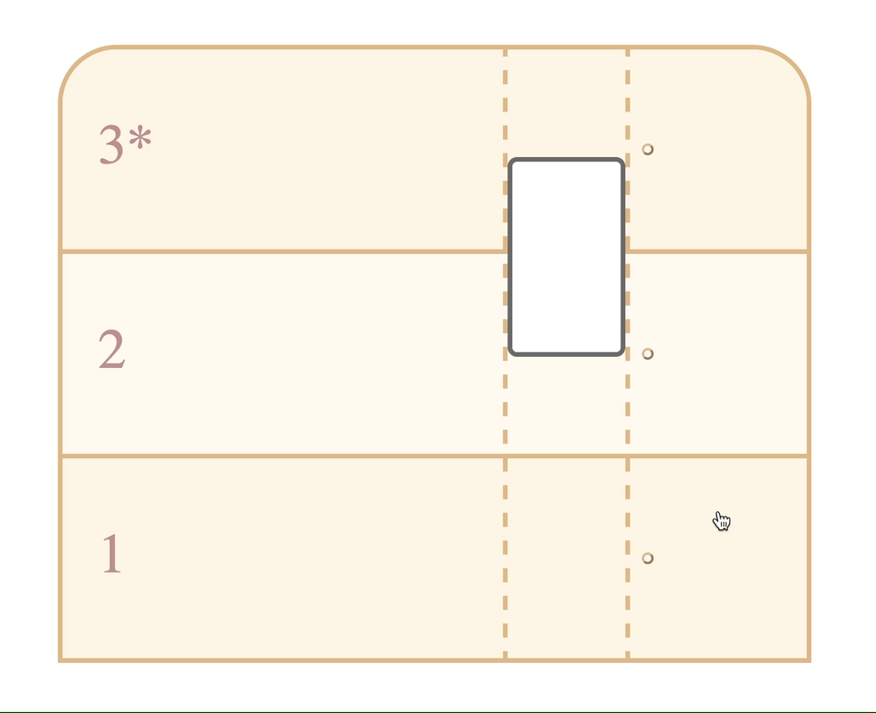
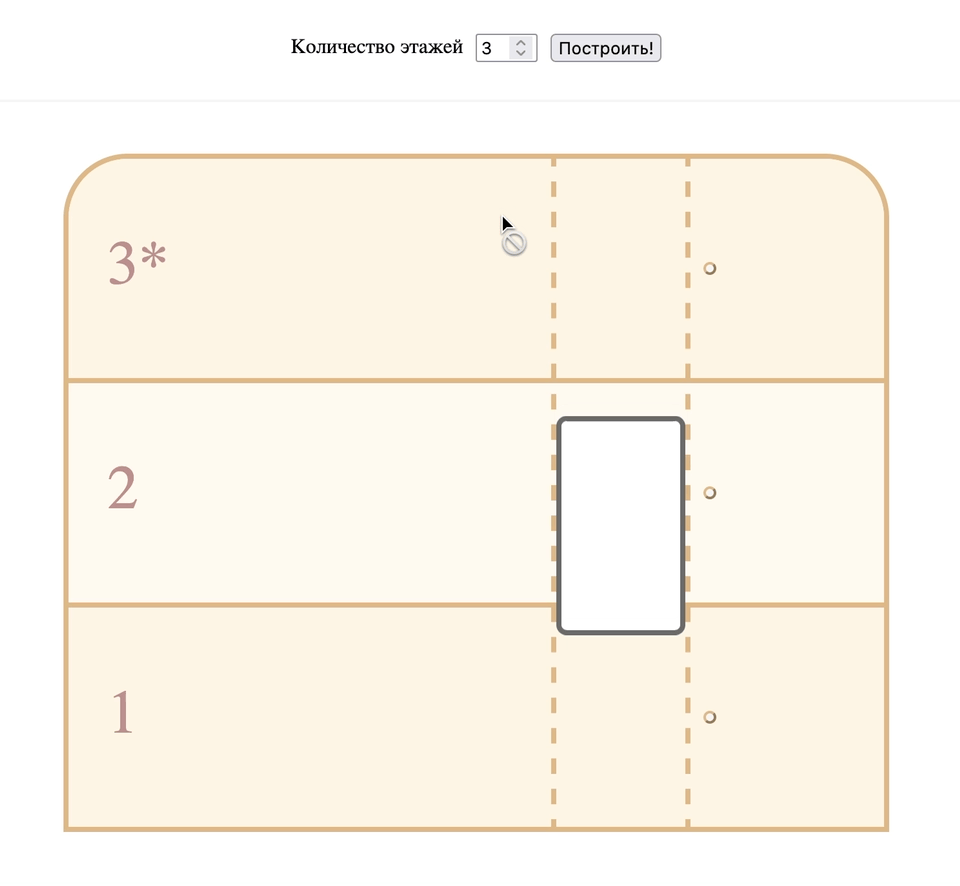

# Лифт

Привет! Нужно смоделировать упрощённое поведение лифта в многоэтажном здании. Двигайся шаг за шагом и тестируй код в браузере — чтобы убедиться, что всё работает правильно.

Цель: поработать с JS, DOM, событиями браузера, а также углубить навыки работы с CSS и HTML.

## Release 1. Сверстать трёхэтажное здание с лифтом
Сверстай страницу на HTML и CSS для отображения здания в разрезе + лифта внутри. Дизайн может быть любым на твоё усмотрение. Поработай в формате mobile-first — сначала сверстай мобильную версию, а потом добавь адаптивность для больших экранов.

<!-- markdownlint-disable no-inline-html -->

  
Пример вёрстки на малом экране

  

  
...и на крупном экране

  

<!-- markdownlint-enable no-inline-html -->

Используй [data-атрибуты](https://developer.mozilla.org/ru/docs/Learn/HTML/Howto/Use_data_attributes) для хранения данных — например, номера этажа, текущего выбранного этажа и так далее.

Отметь выбранный этаж каким-либо образом. Например, на скриншоте выше активный этаж отмечен звёздочкой рядом с номером этажа.

Настрой CSS-переходы или анимации. Протестируй их через инструменты разработчика в браузере — убедись, что при изменении data-атрибута для текущего выбранного этажа свёрстанный лифт движется на нужный этаж.

Сделай как минимум один коммит для этих изменений.

## Release 2. Реализовать простую логику работы лифта
1. Лифт должен подниматься на этаж при нажатии на кнопку вызова.
2. Лифт должен доезжать до нужного этажа и останавливаться.
3. Лифт должен игнорировать все входящие вызовы, пока не завершит своё движение.

<!-- markdownlint-disable no-inline-html -->

  
Пример работы лифта

  

<!-- markdownlint-enable no-inline-html -->

Поработай с событиями браузера. Например, можно использовать событие `click` для кнопок вызова лифта. Посмотри в сторону [делегирования событий](https://habr.com/ru/post/512782/). Например, можно использовать событие `click` для родительского элемента, а не для каждой кнопки вызова.

Поработай с навигацией по DOM-элементам. Например, можно использовать методы `querySelector` и `querySelectorAll` для поиска нужных элементов. Используй CSS-классы с префиксом `js-` для поиска элементов в JavaScript-коде.

Поработай с data-атрибутами. Например, можно использовать метод `getAttribute` или объект `dataset` для получения номера этажа, на котором находится лифт.

Сделай как минимум один коммит для этих изменений.

## Release 3. Генерировать здание динамически
Сделай форму генерации здания — принимай количество этажей от пользователя и создавай здание нужной высоты.

<!-- markdownlint-disable no-inline-html -->

  
Пример генерации здания

  

<!-- markdownlint-enable no-inline-html -->

Поработай с формами. Например, можно использовать событие `submit` для генерации здания.

Задай минимальное и максимальное количество этажей. Например, можно использовать атрибуты `min` и `max` для поля ввода.

Убедись, что при генерации нового здания лифт всегда находится на первом этаже. Проверь, что логика работы лифта не сломалась. При необходимости исправь свой код.

Сделай как минимум один коммит для этих изменений.

## Опубликовать проект
Сделай проект публичным — например, можно воспользоваться [Netlify](https://www.netlify.com/) для автоматического деплоя приложения при каждом коммите в основную ветку репозитория.

Проверь, что всё работает правильно. Поделись ссылкой на проект в канале `#show` в Slack, а также снимками или записями экрана.

## Release 4. Улучшить модель лифта*
Есть силы и желание? Подумай, как можно улучшить свою реализацию. Вот примеры того, что можно сделать:

- написать юнит тесты для существующего кода с помощью Jest;

- создать очередь вызовов лифта и обрабатывать её по мере возможности;

- на каждый запрос лифта добавить персонажа, который будет заходить в лифт на выбранном этаже и запрашивать случайный этаж.

Каждое из этих улучшений можно реализовать в отдельной ветке (feature branch) и сделать Pull Request в свою основную ветку. При этом в основной ветке должен остаться рабочий код без багов.

---
Хорошей тебе работы!
